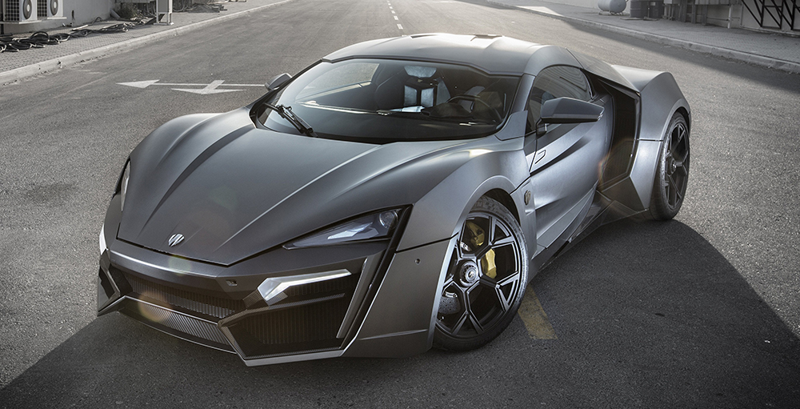
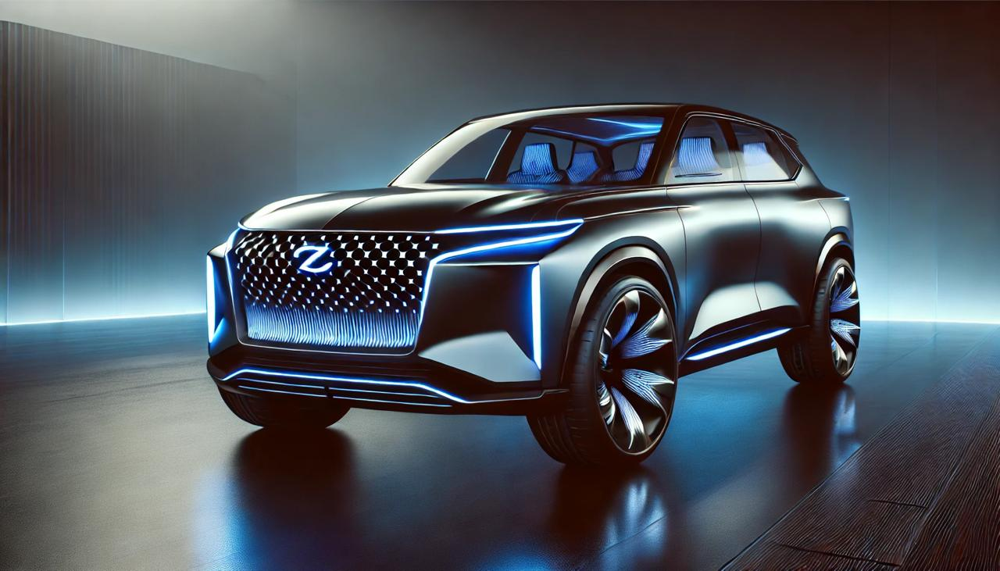

<html lang="pt">
<head>
    <meta charset="UTF-8">
    <meta name="viewport" content="width=device-width, initial-scale=1.0">
    <title>Zun’s Auto - Landing Page</title>
    
</head>
<body>
    <header>
        <h1>Zun’s Auto</h1>
        <nav>
            <ul>
                <li><a href="#modelos">Modelos</a></li>
                <li><a href="#historia">História</a></li>
                <li><a href="#ceo">CEO</a></li>
                <li><a href="#pagamento">Pagamentos</a></li>
                <li><a href="#contato">Contato</a></li>
            </ul>
        </nav>
    </header>

    

        <input type="text" placeholder="Pesquise modelos ou peças...">
    

    
    <section id="modelos" class="modelos">
        <h2>Modelos da Zun’s Auto</h2>
        

            

                
                <h3>Zun’s Atlas</h3>
                
Um SUV espaçoso e luxuoso, com tração sofisticada e um design marcante.

                
<strong>Preço: $50,000</strong>

                <a href="#" class="buy-button">Comprar</a>
            

            

                
                <h3>Zun’s Z-Prime</h3>
                
Modelo acessível e inovador, perfeito para quem busca eficiência e estilo.

                
<strong>Preço: $35,000</strong>

                <a href="#" class="buy-button">Comprar</a>
            

        

    </section>

    <section id="historia" class="historia">
        <h2>História da Zun’s Auto</h2>
        
A Zun’s Auto nasceu do sonho de criar veículos inovadores e acessíveis. Com um design marcante e tecnologia de ponta, a marca busca oferecer o melhor em mobilidade e conforto.

    </section>

    <section id="ceo" class="ceo">
        <h2>Conheça o CEO</h2>
        
        
Simone Zua, fundador e CEO da Zun’s Auto, é apaixonado por inovação automotiva e está comprometido em trazer ao mercado veículos modernos e acessíveis para todos.

    </section>

    <section id="pagamento" class="pagamento">
        <h2>Opções de Pagamento</h2>
        
Aceitamos pagamentos via:

        <ul>
            <li>Cartão de Crédito (Visa, Mastercard, Multicaixa Express)</li>
            <li>Transferência Bancária</li>
            <li>Pagamento na Entrega</li>
        </ul>
    </section>
    
    <section id="contato" class="contato">
        <h2>Contato</h2>
        
Email: <a href="mailto:contato@zunsauto.com">contato@zunsauto.com</a>

        
Telefone: <a href="tel:+244924222612">+244 924 222 612</a>

        
Endereço: Luanda, Angola

    </section>
    
    <footer>
        
&copy; 2025 Zun’s Auto - Todos os direitos reservados.

    </footer>
</body>
</html>
